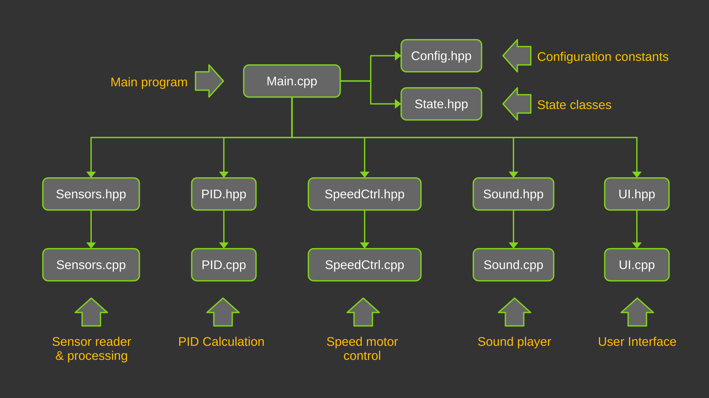
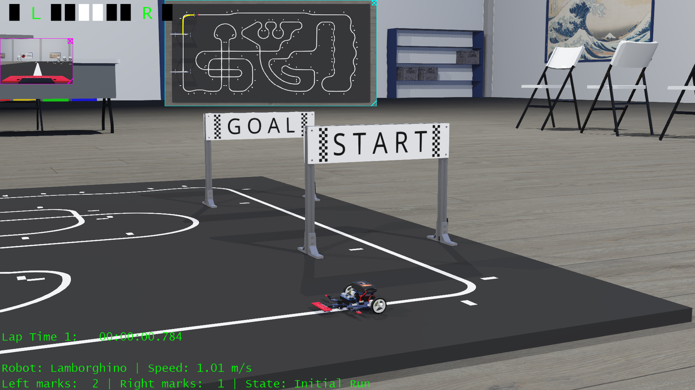
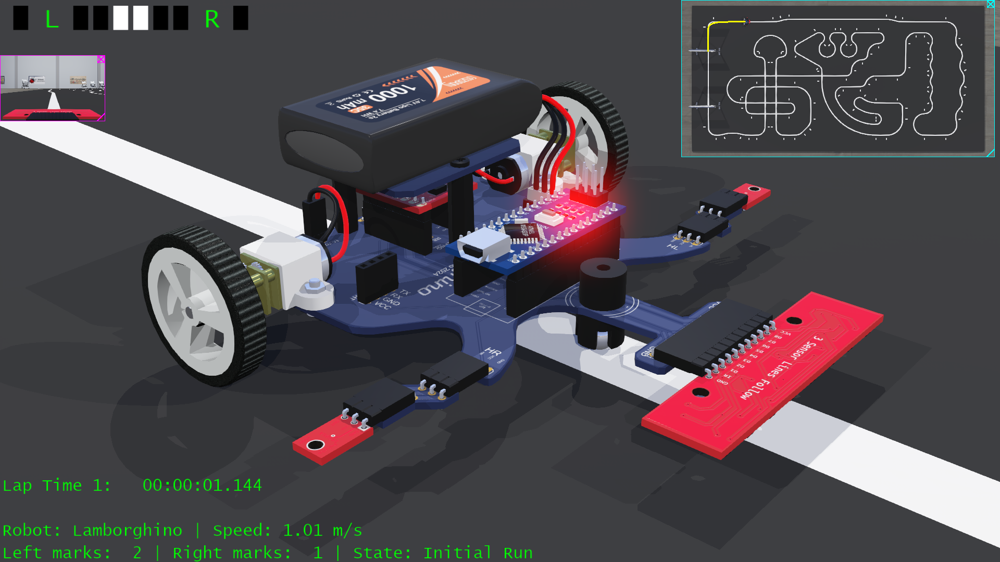
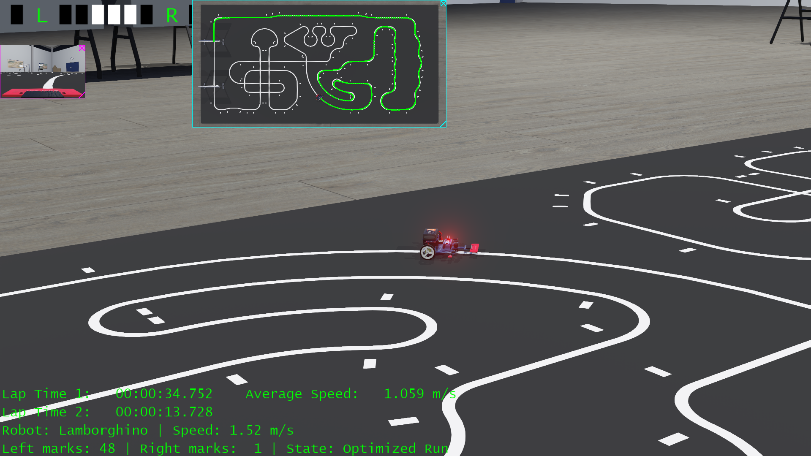
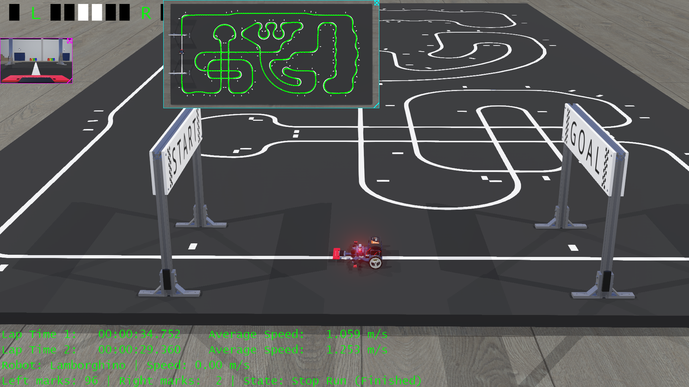
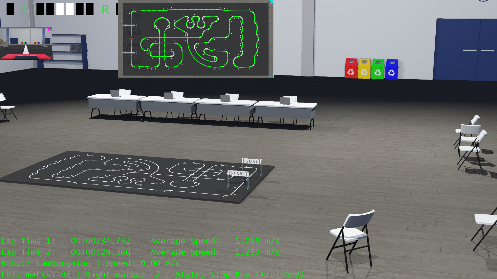

# 🏎️ Autonomous Line-Following Robot Controller (Webots – C++)

*Based on the Open Lamborghino platform*

---

## 📌 Project Overview

This project implements an **advanced autonomous line-following robot controller** written in **C++ for Webots**, targeting a robotracer-style differential drive robot.

The controller includes sensor calibration, PID-based steering, track learning, and **progressive speed optimization** designed to preserve stability while improving lap time.

The current optimized run improves performance by using conservative speed adaptation and smooth acceleration.
Further improvements are expected once **full curvature-based speed profiling** is enabled.

---

## 🚧 Current Implementation Status

### Fully implemented features
- Automatic sensor calibration
- Finite state machine control
- PID-based line following
- Track segmentation and curvature estimation
- Progressive speed control

### Planned extensions
- Per-segment dynamic speed profiling based on learned curvature
- Adaptive PID gains per track segment

The main objective is to **minimize lap time while maintaining reliable line tracking**, taking into account both physical and simulation constraints.

---

## 🌍 Webots World Structure

The simulation is built around a complete Webots world that combines **functional separation** and **visual realism**.
Each component has a specific responsibility, allowing clean interaction between control logic, visualization, and timing.

### World Components

- **WorldInfo**
  Defines global simulation parameters such as time step, physics, and world behavior.

- **Viewpoint**
  Controls the main 3D camera parameters used for visualization.

- **TexturedBackground**
  Provides background textures and lighting conditions for the environment.

- **Sport Center (Solid)**
  A 3D sports center model used as the main environment backdrop.

- **Furnished Group**
  A set of desks, chairs, and computers that enrich the indoor scene and provide a realistic context.

```
World
├── Environment (Sport Center, Furniture)
├── Visualization (Follower_cam Robot)
├── Timing & Events (Start_goal Robot)
└── Autonomous Control (Lamborghino Robot)
```

---

### Robots in the World

- **Follower_cam Robot**
  A lightweight robot equipped with a follow camera.
  Its controller keeps the Lamborghino robot centered in view while applying a smooth oscillatory motion, improving visual tracking and presentation.

- **Start_goal Robot**
  A dedicated robot responsible for detecting start and goal events on the track.
  It measures lap time independently from the main robot controller, ensuring clean performance evaluation.

- **Lamborghino Robot (Robotracer)**
  The main autonomous robot controlled by this project.
  It performs:
  - Sensor calibration
  - Initial track learning
  - Optimized speed control on subsequent runs

---

## ⚠️ Model & Physical Limitations

The robot model does **not include a suction or downforce system**.

### As a result:
- Abrupt acceleration may cause the front of the robot to lift
- Sudden speed changes can reduce sensor contact and stability
- High-speed entry into tight curves may lead to track loss

### For this reason, the controller applies:
- Progressive speed changes
- Dynamic speed limits
- Curvature-aware speed reduction

These constraints closely reflect the behavior of the **real Open Lamborghino platform**.

---

## 📊 Performance Summary
```
├── Track length:          36.8 m
├── Curvature marks:         96
├── Initial lap time:    34.752 s
├── Optimized lap time:  29.488 s
```
Performance depends on simulation parameters and host machine capabilities.

---

## 🧱 Code Architecture

The controller is fully modular and split into multiple files:

```
├── Lambo_FSM001.cpp    // State machine and orchestration (Main)
├── Sensors.*           // Sensor handling & normalization
├── PID.*               // PID controller
├── SpeedCtrl.*         // Motor and speed management
├── UI.*                // 3D visualization (Supervisor labels)
├── State.*             // Robot states & stop reasons
├── Config.hpp          // Global configuration & constants
```



---

## ▶️ How to Use

1. Clone the repository
2. Open the world in Webots
3. Run the simulation
4. Observe: calibration → initial run → optimized run

No manual tuning is required for basic operation.

---

## 💻💾 Hardware and software equipment used
```
- Host: Victus by HP Laptop 16-d0xxx
- CPU: 11th Gen Intel i7-11800H (16) @ 4.600GHz
- GPU: NVIDIA GeForce RTX 3060 Mobile / Max-Q
- Memory: 31727MiB 
- OS: Ubuntu 24.04.3 LTS x86_64
- Simulator: Webots
- 3D design: Blender
- Textures: Inkscape & Gimp
```
---

## 💬 Feedback & Contributions

Feedback is welcome in the following areas:
- Control logic improvements
- PID tuning strategies
- Performance on different machines
- Code structure and maintainability
- Webots-specific optimizations

Please refer to **CONTRIBUTING.md** before submitting changes.

---

## 📸 Screenshots & Visualization


*Webots world overview showing the sports center environment, track layout, and autonomous Lamborghino robot during simulation.*


*Lamborghino robot (robotracer) following the track using PID control and progressive speed optimization.*


*Real-time 3D labels displaying robot speed, sensor states, and detected track marks during execution.*


*Optimized run after track learning, where the robot increases speed on straight segments and slows down before sharp curves.*


*Indoor sports center environment with furnished elements used to provide a realistic simulation context.*


[](https://www.youtube.com/watch?v=fQJVO7WQYRE)

*Complete video showing the three states from calibration, initial run and optimized run.*

---

## 🚫 Non-Goals & Project Scope

This project is published as a technical and educational contribution to help analyze and understand the behavior of the Open Lamborghino robot platform through simulation.

This project is NOT intended to:
- ❌ Commercialize the Open Lamborghino platform
- ❌ Claim ownership of the Lamborghino concept, design, or brand
- ❌ Replace or compete with the original Open Lamborghino project
- ❌ Serve as a closed or proprietary solution

---

## 🎓 Project Intent

The primary goals of this repository are:
- To explore control strategies in simulation
- To study line-following performance under realistic physical constraints
- To evaluate PID behavior, speed profiling, and track learning
- To provide a reference implementation for experimentation and learning

This project exists as a supportive and complementary effort to the Open Lamborghino ecosystem, offering:
- A simulation-based environment
- A modular C++ controller architecture
- Reproducible experiments without hardware risk

---

## 🤝 Relationship to Open Lamborghino

- All credit for the robot concept belongs to the Open Lamborghino project and its contributors
- This repository aims to add value through simulation, not ownership
- Improvements developed here are intended to be shared openly

Contributors are encouraged to respect the spirit of open collaboration and attribution.

---

## 🌱 Philosophy

This repository prioritizes:
- Learning over optimization-at-all-costs
- Transparency over abstraction
- Stability and realism over raw speed

Any contribution should align with these principles.

## 💡 Final note
“If this work helps improve understanding or development of the Open Lamborghino platform on the Robotrace competition, it has fulfilled its purpose.”

---

## 🔗 External Sources

- **Webots Simjulator**
  https://cyberbotics.com/

- **Open Lamborghino**
  https://lamborghino.com
  https://github.com/AndresBercovich/OpenLamborghino

- **41st Micromouse Chubu Regional Tournament**
  https://www.ntf.or.jp/mouse/micromouse2024/local.html#chubu
  https://www.ntf.or.jp/mouse/micromouse2024/MM2024_chubu_RT.png

- **Robotrace Competition Rules**
  https://www.ntf.or.jp/?page_id=68

- **DrakeDG**
  https://x.com/draker_dg
  www.youtube.com/@DrakerDG


